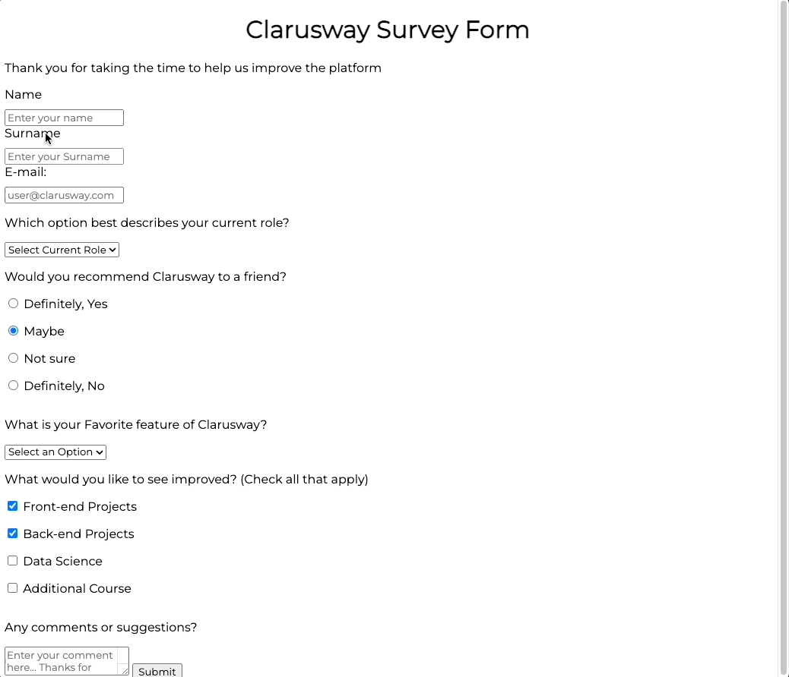

# PROJELERIM

# Muharrem Gem

## HTML CSS

  Project Name       |Libraries and Technologies I use     |How does my project look   
:-------------------------|-------------------------|-------------------------
[Survey Form](https://muharremgem.github.io/HTML_CSS_Survey_form/)| Html Css  |

  Project Name       |Libraries and Technologies I use     |How does my project look   
:-------------------------|-------------------------|-------------------------
[Netflix_clone](https://muharremgem.github.io/HTML_CSS_Netflix_clone/)| Html Css  |

  Project Name       |Libraries and Technologies I use     |How does my project look   
:-------------------------|-------------------------|-------------------------
[Google_clone](https://muharremgem.github.io/HTML_CSS_Google_clone/)| Html Css  |

  Project Name       |Libraries and Technologies I use     |How does my project look   
:-------------------------|-------------------------|-------------------------
[Parallax](https://muharremgem.github.io/HTML_CSS_Parallax/)| Html Css  |

  Project Name       |Libraries and Technologies I use     |How does my project look   
:-------------------------|-------------------------|-------------------------
[5- Clarusway Website Design](https://javascript-digital-clock-24akepg2y-muharremgem.vercel.app/)| 5- Clarusway Website Design		 |

  Project Name       |Libraries and Technologies I use     |How does my project look   
:-------------------------|-------------------------|-------------------------
[Checkout](https://muharremgem.github.io/HTML_CSS_Checkout/)| Html Css  |

  Project Name       |Libraries and Technologies I use     |How does my project look   
:-------------------------|-------------------------|-------------------------
[TeamMembers](https://muharremgem.github.io/HTML_CSS_TeamMembers/)| Html Css  |

  Project Name       |Libraries and Technologies I use     |How does my project look   
:-------------------------|-------------------------|-------------------------
[8- Bootsrap Home Page](https://javascript-digital-clock-24akepg2y-muharremgem.vercel.app/)| 8- Bootsrap Home Page		 |

  Project Name       |Libraries and Technologies I use     |How does my project look   
:-------------------------|-------------------------|-------------------------
[9- Bootsrap School Webseite](https://www.muharremgem.com/)| 9- Bootsrap School Webseite		 |

  Project Name       |Libraries and Technologies I use     |How does my project look   
:-------------------------|-------------------------|-------------------------
[10- SASS Profile Webseite](https://html-css-js-calculator.vercel.app/)| 10- SASS Profile Webseite  |

## JAVASCRIPT

  Project Name       |Libraries and Technologies I use     |How does my project look   
:-------------------------|-------------------------|-------------------------
[1- Find the Number](https://javascript-digital-clock-24akepg2y-muharremgem.vercel.app/)| 1- Find the Number	 	 |

  Project Name       |Libraries and Technologies I use     |How does my project look   
:-------------------------|-------------------------|-------------------------
[2- To-Do App](https://www.muharremgem.com/)| 2- To-Do App		 |

  Project Name       |Libraries and Technologies I use     |How does my project look   
:-------------------------|-------------------------|-------------------------
[3- Hangman Game](https://html-css-js-calculator.vercel.app/)| 3- Hangman Game			 |

  Project Name       |Libraries and Technologies I use     |How does my project look   
:-------------------------|-------------------------|-------------------------
[4- Lottery Game](https://javascript-digital-clock-24akepg2y-muharremgem.vercel.app/)| 4- Lottery Game 	 |

  Project Name       |Libraries and Technologies I use     |How does my project look   
:-------------------------|-------------------------|-------------------------
[5- Digital Clock](https://www.muharremgem.com/)| 5- Digital Clock	 |

  Project Name       |Libraries and Technologies I use     |How does my project look   
:-------------------------|-------------------------|-------------------------
[6- IOS Calculator](https://html-css-js-calculator.vercel.app/)| 6- IOS Calculator		 |

  Project Name       |Libraries and Technologies I use     |How does my project look   
:-------------------------|-------------------------|-------------------------
[7- Checkout Page](https://javascript-digital-clock-24akepg2y-muharremgem.vercel.app/)| 7- Checkout Page	 	 |

  Project Name       |Libraries and Technologies I use     |How does my project look   
:-------------------------|-------------------------|-------------------------
[8- Movie Seat App](https://www.muharremgem.com/)| 8- Movie Seat App		 |

  Project Name       |Libraries and Technologies I use     |How does my project look   
:-------------------------|-------------------------|-------------------------
[9- Weather App](https://html-css-js-calculator.vercel.app/)| 9- Weather App		 |

  Project Name       |Libraries and Technologies I use     |How does my project look   
:-------------------------|-------------------------|-------------------------
[10- Other Algorithm Tasks](https://javascript-digital-clock-24akepg2y-muharremgem.vercel.app/)| 10- Other Algorithm Tasks		 |

## REACT

  Project Name       |Libraries and Technologies I use     |How does my project look   
:-------------------------|-------------------------|-------------------------
[1- Tour Places	](https://www.muharremgem.com/)| 1- Tour Places	 |

  Project Name       |Libraries and Technologies I use     |How does my project look   
:-------------------------|-------------------------|-------------------------
[2- Language Cards](https://html-css-js-calculator.vercel.app/)| 2- Language Cards		 |

  Project Name       |Libraries and Technologies I use     |How does my project look   
:-------------------------|-------------------------|-------------------------
[3- Random User](https://javascript-digital-clock-24akepg2y-muharremgem.vercel.app/)| 3- Random User	 	 |

  Project Name       |Libraries and Technologies I use     |How does my project look   
:-------------------------|-------------------------|-------------------------
[4- Task Tracker](https://www.muharremgem.com/)| 4- Task Tracker		 |

  Project Name       |Libraries and Technologies I use     |How does my project look   
:-------------------------|-------------------------|-------------------------
[5- Recipe App](https://html-css-js-calculator.vercel.app/)| 5- Recipe App		 |

  Project Name       |Libraries and Technologies I use     |How does my project look   
:-------------------------|-------------------------|-------------------------
[6- Movie App](https://javascript-digital-clock-24akepg2y-muharremgem.vercel.app/)| 6- Movie App		 |

  Project Name       |Libraries and Technologies I use     |How does my project look   
:-------------------------|-------------------------|-------------------------
[7- Blog App](https://www.muharremgem.com/)| 7- Blog App	 |

## DJANGO

  Project Name       |Libraries and Technologies I use     |How does my project look   
:-------------------------|-------------------------|-------------------------
[1- DJANGO PROJE 1](https://html-css-js-calculator.vercel.app/)| 1- DJANGO PROJE 1	 |

  Project Name       |Libraries and Technologies I use     |How does my project look   
:-------------------------|-------------------------|-------------------------
[2- DJANGO PROJE 2 ](https://javascript-digital-clock-24akepg2y-muharremgem.vercel.app/)| 2- DJANGO PROJE 2 	 |

  Project Name       |Libraries and Technologies I use     |How does my project look   
:-------------------------|-------------------------|-------------------------
[3- DJANGO PROJE 3	](https://html-css-js-calculator.vercel.app/)| 3- DJANGO PROJE 3	 |

  Project Name       |Libraries and Technologies I use     |How does my project look   
:-------------------------|-------------------------|-------------------------
[4- DJANGO PROJE 4](https://javascript-digital-clock-24akepg2y-muharremgem.vercel.app/)| 4- DJANGO PROJE 4	 |

  Project Name       |Libraries and Technologies I use     |How does my project look   
:-------------------------|-------------------------|-------------------------
[5- DJANGO PROJE 5](https://html-css-js-calculator.vercel.app/)| 5- DJANGO PROJE 5	 |

  Project Name       |Libraries and Technologies I use     |How does my project look   
:-------------------------|-------------------------|-------------------------
[6- DJANGO PROJE 6](https://javascript-digital-clock-24akepg2y-muharremgem.vercel.app/)| 6- DJANGO PROJE 6 	 |

  Project Name       |Libraries and Technologies I use     |How does my project look   
:-------------------------|-------------------------|-------------------------
[7- DJANGO PROJE 7](https://html-css-js-calculator.vercel.app/)| 7- DJANGO PROJE 7	 |

  Project Name       |Libraries and Technologies I use     |How does my project look   
:-------------------------|-------------------------|-------------------------
[8- DJANGO PROJE 8](https://javascript-digital-clock-24akepg2y-muharremgem.vercel.app/)| 8- DJANGO PROJE 8	 |
