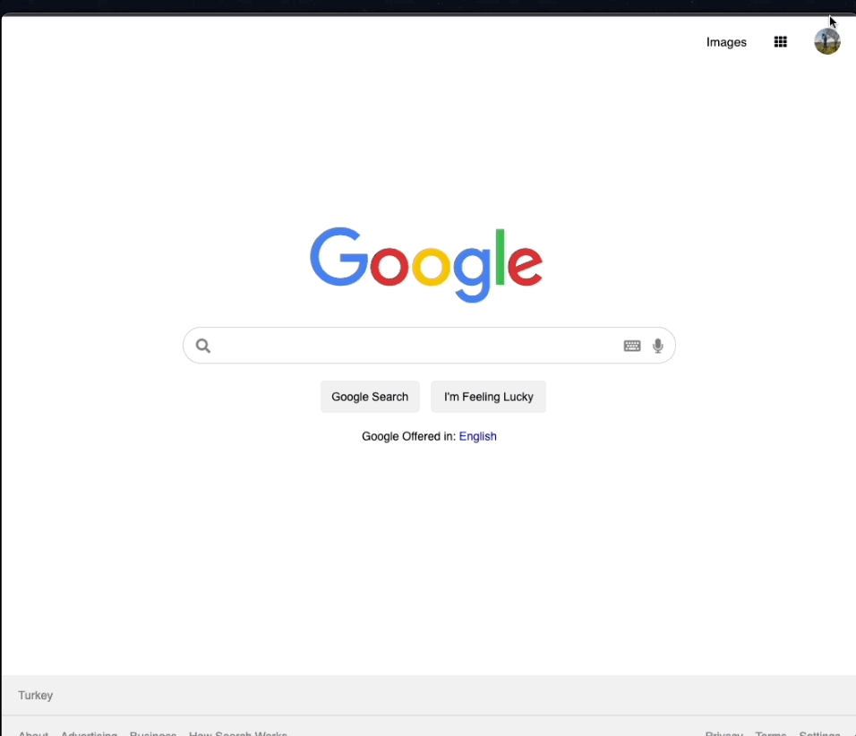
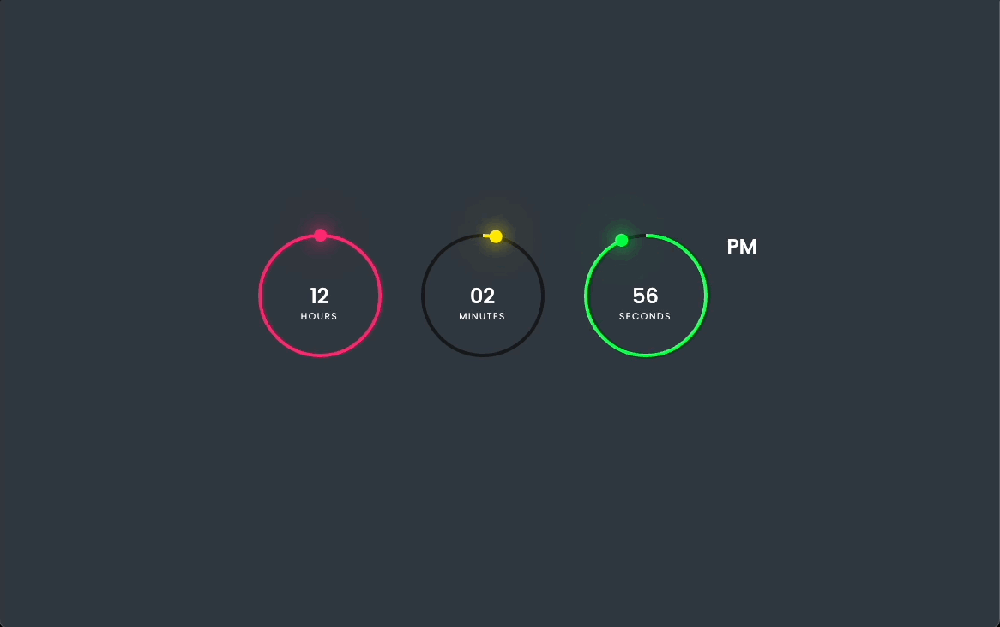
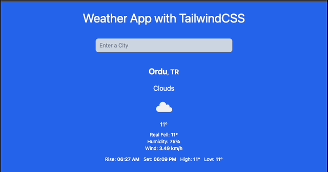
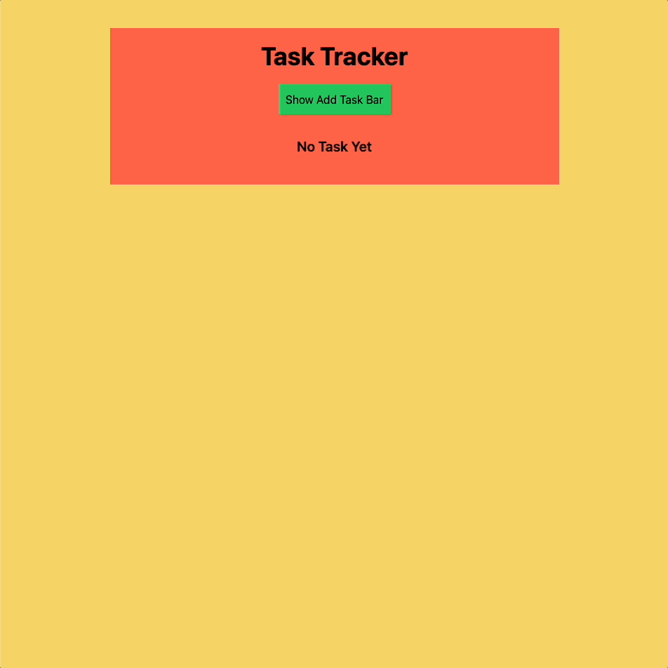
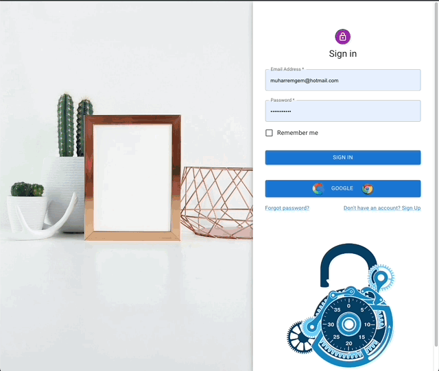
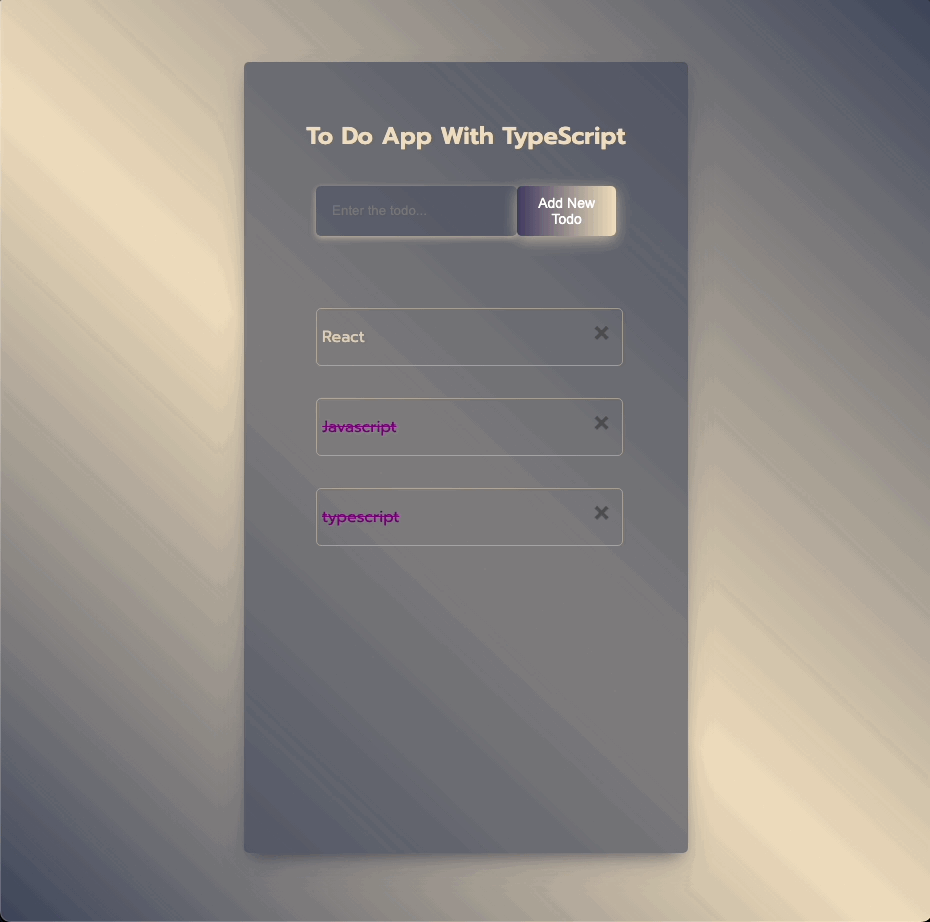

# PROJELERIM

# Muharrem Gem

## HTML CSS

| Project Name                                                       | Libraries and Technologies I use | How does my project look           |
| :----------------------------------------------------------------- | -------------------------------- | ---------------------------------- |
| [Survey Form](https://muharremgem.github.io/HTML_CSS_Survey_form/) | Html Css                         |  |

| Project Name                                                           | Libraries and Technologies I use | How does my project look     |
| :--------------------------------------------------------------------- | -------------------------------- | ---------------------------- |
| [Netflix_clone](https://muharremgem.github.io/HTML_CSS_Netflix_clone/) | Html Css                         |  |

| Project Name                                                         | Libraries and Technologies I use | How does my project look        |
| :------------------------------------------------------------------- | -------------------------------- | ------------------------------- |
| [Google_clone](https://muharremgem.github.io/HTML_CSS_Google_clone/) | Html Css                         |  |

| Project Name                                                 | Libraries and Technologies I use | How does my project look      |
| :----------------------------------------------------------- | -------------------------------- | ----------------------------- |
| [Parallax](https://muharremgem.github.io/HTML_CSS_Parallax/) | Html Css                         |  |

| Project Name                                                 | Libraries and Technologies I use | How does my project look          |
| :----------------------------------------------------------- | -------------------------------- | --------------------------------- |
| [Checkout](https://muharremgem.github.io/HTML_CSS_Checkout/) | Html Css                         |  |

| Project Name                                                       | Libraries and Technologies I use | How does my project look              |
| :----------------------------------------------------------------- | -------------------------------- | ------------------------------------- |
| [TeamMembers](https://muharremgem.github.io/HTML_CSS_TeamMembers/) | Html Css                         |  |

| Project Name                                       | Libraries and Technologies I use | How does my project look    |
| :------------------------------------------------- | -------------------------------- | --------------------------- |
| [WebPage](https://bootstrap-web-page.vercel.app/#) | Html Css Bootstrap               |  |

| Project Name                                                                 | Libraries and Technologies I use | How does my project look                     |
| :--------------------------------------------------------------------------- | -------------------------------- | -------------------------------------------- |
| [Bootsrap School Webseite](https://muharremgem.github.io/BOOTSTRAP_project/) | Html Css Bootstrap               |  |

| Project Name                                                | Libraries and Technologies I use | How does my project look      |
| :---------------------------------------------------------- | -------------------------------- | ----------------------------- |
| [SASS_Project](https://muharremgem.github.io/SASS_Project/) | Html Css Sass                    |  |

## JAVASCRIPT

| Project Name                                                     | Libraries and Technologies I use | How does my project look        |
| :--------------------------------------------------------------- | -------------------------------- | ------------------------------- |
| [Todo_list](https://muharremgem.github.io/JavaScript_Todo_list/) | Html Css Js                      |  |

| Project Name                                                                        | Libraries and Technologies I use | How does my project look        |
| :---------------------------------------------------------------------------------- | -------------------------------- | ------------------------------- |
| [Digital_Clock](https://javascript-digital-clock-24akepg2y-muharremgem.vercel.app/) | Html Css Js                      |  |

| Project Name                                             | Libraries and Technologies I use | How does my project look          |
| :------------------------------------------------------- | -------------------------------- | --------------------------------- |
| [Calculator](https://html-css-js-calculator.vercel.app/) | Html Css Js                      |  |

| Project Name                                                                | Libraries and Technologies I use | How does my project look          |
| :-------------------------------------------------------------------------- | -------------------------------- | --------------------------------- |
| [7- Checkout Page](https://muharremgem.github.io/JAVASCRIPT_Checkout_Page/) | 7- Checkout Page                 |  |

| Project Name                                                     | Libraries and Technologies I use | How does my project look        |
| :--------------------------------------------------------------- | -------------------------------- | ------------------------------- |
| [weather_App](https://react-alpha-team-weather-hrd5.vercel.app/) | Html Css Js React                |  |

## REACT

| Project Name                                       | Libraries and Technologies I use | How does my project look          |
| :------------------------------------------------- | -------------------------------- | --------------------------------- |
| [Tour_Places](https://reacttourplaces.vercel.app/) | Html Sass Js React               |  |

| Project Name                                                    | Libraries and Technologies I use | How does my project look               |
| :-------------------------------------------------------------- | -------------------------------- | -------------------------------------- |
| [Language_Card](https://react-language-cards-seven.vercel.app/) | Js React                         |  |

| Project Name                                                 | Libraries and Technologies I use | How does my project look            |
| :----------------------------------------------------------- | -------------------------------- | ----------------------------------- |
| [Random_user_app](https://react-random-user-app.vercel.app/) | Js React                         |  |

| Project Name                                                       | Libraries and Technologies I use | How does my project look      |
| :----------------------------------------------------------------- | -------------------------------- | ----------------------------- |
| [Task Tracker](https://react-task-tracker-muharremgem.vercel.app/) | Js React                         |  |

| Project Name                                                   | Libraries and Technologies I use | How does my project look        |
| :------------------------------------------------------------- | -------------------------------- | ------------------------------- |
| [Recipe_App](https://react-recipe-app-muharremgem.vercel.app/) | Js React Tailwind                |  |

| Project Name                                             | Libraries and Technologies I use | How does my project look         |
| :------------------------------------------------------- | -------------------------------- | -------------------------------- |
| [fire_contact](https://firecontact-app-roan.vercel.app/) | Js React firebase                |  |

| Project Name                                                                       | Libraries and Technologies I use | How does my project look |
| :--------------------------------------------------------------------------------- | -------------------------------- | ------------------------ |
| [Movie App](https://javascript-digital-clock-24akepg2y-muharremgem.vercel.app/) | 6- Movie App                     |     |

| Project Name                                | Libraries and Technologies I use | How does my project look |
| :------------------------------------------ | -------------------------------- | ------------------------ |
| [Fire_Blog App](https://fireblog-app-muharremgem.vercel.app/) | Firebase React            |          |

| Project Name                                | Libraries and Technologies I use | How does my project look |
| :------------------------------------------ | -------------------------------- | ------------------------ |
| [Typescript_todo](https://typescript-todo-weld.vercel.app/) | TypeScript  React           |          |
